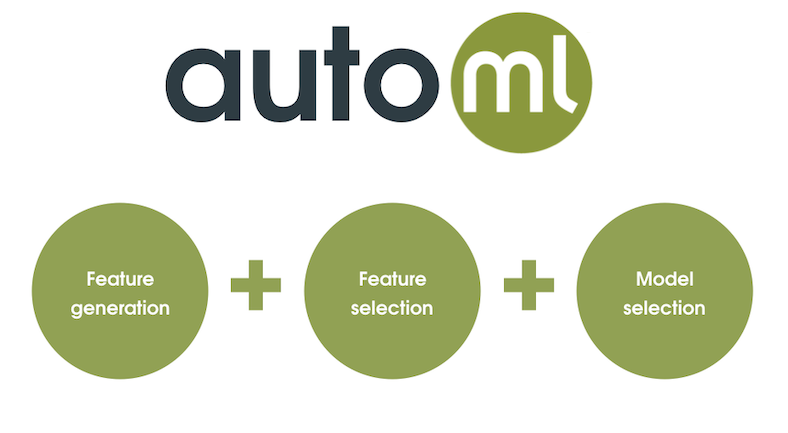

# AutoML Script

These WhizzML scripts will let the user run a **fully automated
Machine Learning pipeline** in BigML.

From a train, validation and test datasets, the following tasks will be
automatically done:

-  `Unsupervised Models Generation`: Creating the following
  **unsupervised models**: `Cluster`, `Anomaly Detector`, `Association
  Discovery` (with leverage and lift as search_strategy), `PCA` and
  `Topic Model` (for datasets that contain text fields).
-  `Feature Generation`: Using the unsupervised models created
  previously to append automatically generated new features to all the
  user given datasets.
- `Feature Selection`: Reducing, automatically,
  the number of fields of the datasets using the **Recursive Feature
  Eliminination** algorithm.
-  `Model Selection` Using OptiML to find the best models and using
  the top 3 models to create a `Fusion` model to predict all the test
  dataset instances. If a validation dataset is given, this script
  will return an evaluation of the final model too.

The **inputs** for the script are:

* `train-dataset`: (string) Dataset id for the train dataset
  (e.g. dataset/5d272205eba31d61920005cd). If no train dataset is
  provided, the script will expect an `automl-execution` to be
  provided and will use its models as starting point.
* `validation-dataset`: (string) Dataset id for the validation dataset
  (e.g. dataset/5d272205eba31d61920005cd). If empty, no
  output-evalution is returned.
* `test-dataset`: (string) Dataset id for the test dataset
  (e.g. dataset/7j272205eba31d61920005vf). If empty, no output-dataset
  is returned.
* `automl-exection`: (string) Previous execution of this script, to
  reuse created executions and models,
  e.g. execution/5d272205eba31d61920005cd. Either `train-dataset` or
  `automl-execution` should be provided for the script to work. When
  both are provided, the `automl-execution` argument is discarded and
  new resources are generated from the training data.
* `excluded-fields`: (list) List of fields that will be excluded from
  any dataset before any other process starts. e.g. ["bmi",
  "age"]. Empty by default
* `excluded-models`: (list) List of unsupervised models that won't be
  created nor reused during feature generation. e.g. ["anomaly",
  "cluster"]. Possible values are: association, cluster, anomaly, pca
  or topicmodel. Empty by default
* `pca-variance-threshold`: (number) The PCA projection uses the
  minimum number of components such that the cumulative explained
  variance is greater than the given threshold. Values from 0
  to 1. Default value is 1 (all the components will be used)
* `leverage-threshold`: (number) Associations with a leverage
  (absolute value) lower than the threshold will be ignored. Default
  value is 0 (all the association will be added to the extended
  dataset)

The **outputs** for the script are:
* `output-dataset`: (dataset-id) Dataset with final predictions for the test dataset
* `output-evaluation`: (evaluation-id) Evaluation of the `Fusion`
  model using the `validation-dataset`
* `output-fusion`: (fusion-id) Output fusion model
* `selected-fields`: (list) Selected important field names
* `unsupervised-models`: (list) List of unsupervised models created
  from train-dataset

## Usage
There are two different ways of using this script:

### From a train and a test dataset (and an optional validation dataset)
In this case, the expected inputs for the script are the
`train-dataset` and the `test-dataset`, with no `autml-execution`
input.  The objective field used in the script will be the one
associated to the datasets used, so remember to choose them previously
in both the training and validation datasets.

The script will run the fully **automated Machine Learning pipeline**
and it will return, at the end of the process, the **output-dataset**
with the final predictions for the test dataset using a `Fusion` with
the best models from the created `OptiML`.

If a validation dataset is given, the script will also return an
`evaluation` of the final `Fusion` model with the
`validation-dataset`.

### From a test dataset and a previous execution id (and an optional validation dataset)
If we want to predict new data using the same models created by a
previously executed `automl` script, you can use the `automl-execution`
parameter (no `train-dataset` parameter needed) associated to that
previous execution and provide the test dataset ID in the
`test-dataset` parameter.

In this case, some steps of the process will be bypassed. The script
won't generate neither a new `OptiML`, unsupervised model nor a
**Recursive Feature Selection** execution.

## FAQ
### Why can't I see, in the scripts inputs in the BigML's dashboard, dropdowns menus to select the dataset, script, etc?
All the input parameters of these scripts are optional. So, they use a
**string** input type instead a `dataset-id` input type,
`execution-id` input type, etc. Using a **string** input type we can
provide a **default empty value** if the user don't want to pass one
input.
